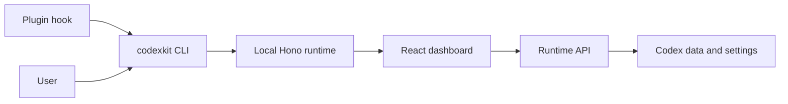

# AGENTS.md

## Repository Defaults

- Use `vp` as the only project toolchain entrypoint.

## Runtime i18n

- UI copy must use `useRuntimeI18n().t`.
- Do not import `m` from `@/locales/paraglide/messages` in components or navigation config.
- Keep locale state and switching in `apps/runtime/src/features/settings/i18n-provider.tsx`; do not set the Paraglide runtime locale elsewhere.

## Architecture

CodexKit is a Codex plugin plus a local dashboard runtime.



## Directory Conventions

```text
.
├── apps/runtime/        # React + Hono dashboard runtime
│   ├── src/app/         # Browser-side horizontal shell: providers, document state, transport adapters
│   ├── src/features/    # Vertical slices: feature UI, hooks, model/types, client/server code, tests
│   ├── src/routes/      # Thin TanStack Router URL adapters; map routes to feature pages
│   ├── src/server/      # Server-side horizontal shell: Hono setup, static serving, route composition
│   ├── src/locales/     # Runtime messages and generated Paraglide output
│   └── src/ui/          # Shared UI primitives and utilities; no feature-specific behavior
├── packages/cli/        # codexkit CLI; starts/stops local runtime
└── plugin/              # Codex plugin manifest, hooks, and skill
```
